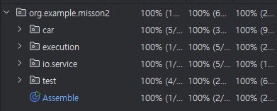
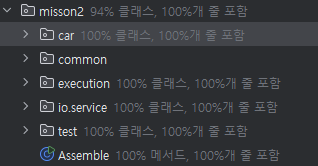

# 공통과제
## D1

```java

    public static final int INVALID_VALUE = -1;
    public static final int STEP_BACK = 0;
    public static final int EXIT_PROGRAM = -999;

    public static final int DRIVING_TEST = 1;
    public static final int PARTS_TEST = 2;

    private static final int[] car = new int[5];
```
1. 상수 추가로 인한 매직 넘버 가독성 향상
2. stack -> car로 의미 전달 높임

```java
    public static void main(String[] args) {
        Scanner sc = new Scanner(System.in);
        int carPartsStep = CarType_Q;

        while (true) {
            clearScreen();
            showMenuByStep(carPartsStep);

            int inputValue = getInputValue(sc, carPartsStep);
            if (inputValue == EXIT_PROGRAM) break;

            carPartsStep = executeByValue(inputValue, carPartsStep);
        }

        sc.close();
    }
```
1. 역할 분리로 인한 main 함수에서 해야하는 일 한눈에 보임.

```java
private static String getEngine(int engine) {
    return engine == 1 ? "GM" : engine == 2 ? "TOYOTA" : engine == 3 ? "WIA" : "고장난 엔진";
}
```

1. 한눈에 보이지않는 코드 메서드로 분리

## D2
/src/test/java에 unit test를 통한 코드 검증 명확화
```java

    @Test
    @DisplayName("truck && wia")
    void testDriving_FAIL1() throws NoSuchFieldException, IllegalAccessException {
        Car car = Car.getInstance();
        CarType carType = new Truck();
        Engine engine = new Wia();
        BreakSystem breakSystem = new BoschB();
        SteeringSystem steeringSystem = new Mobis();

        setField(Car.class, car, "carType", carType);
        setField(Car.class, car, "engine", engine);
        setField(Car.class, car, "breakSystem", breakSystem);
        setField(Car.class, car, "steeringSystem", steeringSystem);

        try(MockedStatic<Car> mockedStaticCar = mockStatic(Car.class)){
            mockedStaticCar.when(Car::getInstance).thenReturn(car);
            drivingTestService.testDriving();
        }
    }

    @Test
    @DisplayName("sedan && continental")
    void testDriving_FAIL2() throws NoSuchFieldException, IllegalAccessException {
        Car car = Car.getInstance();
        CarType carType = new Sedan();
        Engine engine = new Wia();
        BreakSystem breakSystem = new Continental();
        SteeringSystem steeringSystem = new Mobis();

        setField(Car.class, car, "carType", carType);
        setField(Car.class, car, "engine", engine);
        setField(Car.class, car, "breakSystem", breakSystem);
        setField(Car.class, car, "steeringSystem", steeringSystem);

        try(MockedStatic<Car> mockedStaticCar = mockStatic(Car.class)){
            mockedStaticCar.when(Car::getInstance).thenReturn(car);
            drivingTestService.testDriving();
        }
    }

    @Test
    @DisplayName("suv && toyota")
    void testDriving_FAIL3() throws NoSuchFieldException, IllegalAccessException {
        Car car = Car.getInstance();
        CarType carType = new Suv();
        Engine engine = new Toyota();
        BreakSystem breakSystem = new Continental();
        SteeringSystem steeringSystem = new Mobis();

        setField(Car.class, car, "carType", carType);
        setField(Car.class, car, "engine", engine);
        setField(Car.class, car, "breakSystem", breakSystem);
        setField(Car.class, car, "steeringSystem", steeringSystem);

        try(MockedStatic<Car> mockedStaticCar = mockStatic(Car.class)){
            mockedStaticCar.when(Car::getInstance).thenReturn(car);
            drivingTestService.testDriving();
        }
    }

    @Test
    @DisplayName("truck && mando")
    void testDriving_FAIL4() throws NoSuchFieldException, IllegalAccessException {
        Car car = Car.getInstance();
        CarType carType = new Truck();
        Engine engine = new Toyota();
        BreakSystem breakSystem = new Mando();
        SteeringSystem steeringSystem = new Mobis();

        setField(Car.class, car, "carType", carType);
        setField(Car.class, car, "engine", engine);
        setField(Car.class, car, "breakSystem", breakSystem);
        setField(Car.class, car, "steeringSystem", steeringSystem);

        try(MockedStatic<Car> mockedStaticCar = mockStatic(Car.class)){
            mockedStaticCar.when(Car::getInstance).thenReturn(car);
            drivingTestService.testDriving();
        }
    }

    @Test
    @DisplayName("bosch_b && !bosch_s")
    void testDriving_FAIL5() throws NoSuchFieldException, IllegalAccessException {
        Car car = Car.getInstance();
        CarType carType = new Truck();
        Engine engine = new Toyota();
        BreakSystem breakSystem = new BoschB();
        SteeringSystem steeringSystem = new Mobis();

        setField(Car.class, car, "carType", carType);
        setField(Car.class, car, "engine", engine);
        setField(Car.class, car, "breakSystem", breakSystem);
        setField(Car.class, car, "steeringSystem", steeringSystem);

        try(MockedStatic<Car> mockedStaticCar = mockStatic(Car.class)){
            mockedStaticCar.when(Car::getInstance).thenReturn(car);
            drivingTestService.testDriving();
        }
    }

    @Test
    @DisplayName("engine null")
    void testDriving_FAIL6() throws NoSuchFieldException, IllegalAccessException {
        Car car = Car.getInstance();
        CarType carType = new Truck();
        Engine engine = null;
        BreakSystem breakSystem = new BoschB();
        SteeringSystem steeringSystem = new Mobis();

        setField(Car.class, car, "carType", carType);
        setField(Car.class, car, "engine", engine);
        setField(Car.class, car, "breakSystem", breakSystem);
        setField(Car.class, car, "steeringSystem", steeringSystem);

        try(MockedStatic<Car> mockedStaticCar = mockStatic(Car.class)){
            mockedStaticCar.when(Car::getInstance).thenReturn(car);
            drivingTestService.testDriving();
        }
    }


    @Test
    @DisplayName("success test")
    void testDriving_Success() throws NoSuchFieldException, IllegalAccessException {
        Car car = Car.getInstance();
        CarType carType = new Truck();
        Engine engine = new Toyota();
        BreakSystem breakSystem = new BoschB();
        SteeringSystem steeringSystem = new BoschS();

        setField(Car.class, car, "carType", carType);
        setField(Car.class, car, "engine", engine);
        setField(Car.class, car, "breakSystem", breakSystem);
        setField(Car.class, car, "steeringSystem", steeringSystem);

        try(MockedStatic<Car> mockedStaticCar = mockStatic(Car.class)){
            mockedStaticCar.when(Car::getInstance).thenReturn(car);
            drivingTestService.testDriving();
        }
    }
```
여러가지 테스트 케이스로 실패상황 검증

## D3
`/misson2/car` package에서 data, service로 계층을 나누어 역할의 분리

domain(`car, execution, io, test`)별 분리를 통해 코드 변경이 다른 domain의 영향을 주지 않음
package hieracy를 통해 확인 가능

## D4
싱글톤 패턴과 팩토리 패턴을 구현
```java
public class Car {
    private static Car instance;
    CarType carType;
    Engine engine;
    BreakSystem breakSystem;
    SteeringSystem steeringSystem;

    private Car(){}

    public static Car getInstance() {
        if (instance == null) {
            instance = new Car();
        }
        return instance;
    }

```

Car를 싱글톤으로 구현해 단일 객체로서 데이터 무결성을 보장함

```java
public class BreakSystemFactory {
    public static BreakSystem createBreakSystem(BreakSystemEnum breakSystem) {
        return switch (breakSystem) {
            case MANDO -> new Mando();
            case CONTINENTAL -> new Continental();
            case BOSCH_B -> new BoschB();
        };
    }
}
```
factory 패턴을 적용해 각 종류에 따른 생성에 유연성을 보장함


## D5



/common package는 Constants용 객체라서 coverage상 나타나지 않음
```java
public class ProgramConstants {
    public static final int EXIT_PROGRAM = -999;
    public static final int INVALID_VALUE = -1;
    public static final int STEP_BACK = 0;
}

public class TestConstants {
    public static final int DRIVING_TEST = 1;
    public static final int PARTS_TEST = 2;
    public static final String CLEAR_SCREEN = "\033[H\033[2J";
}
```